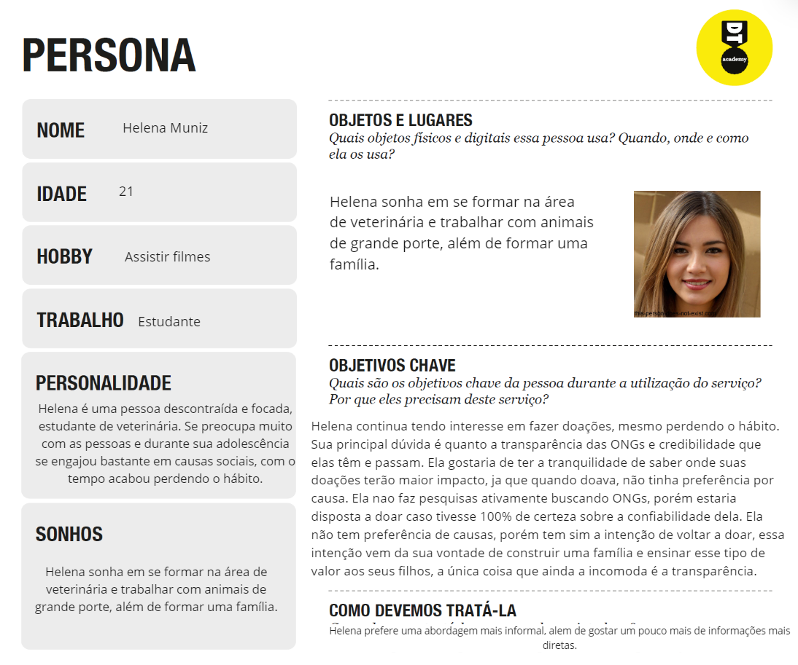
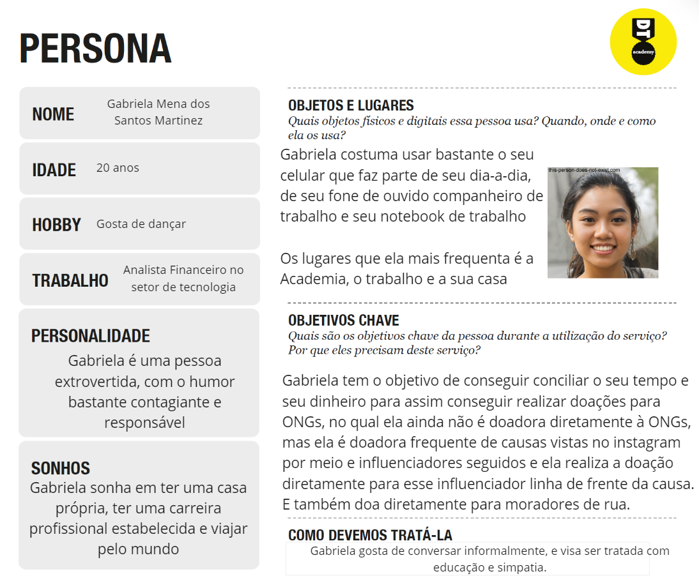
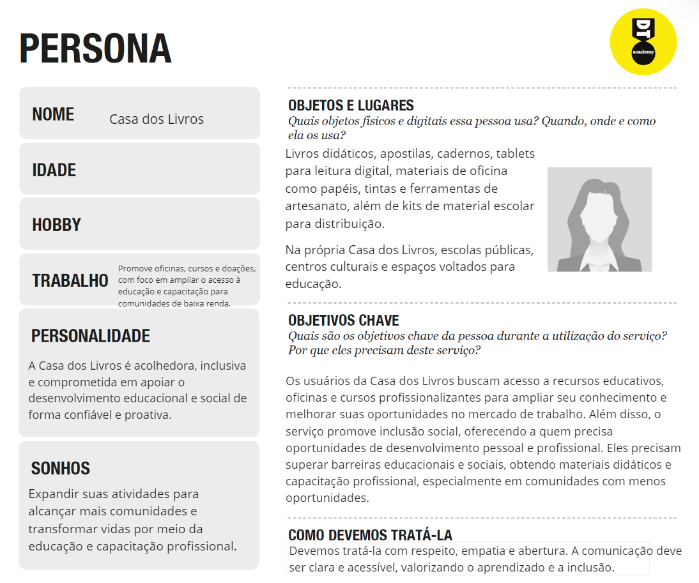
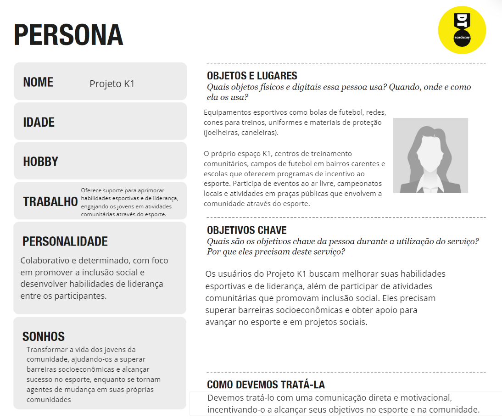
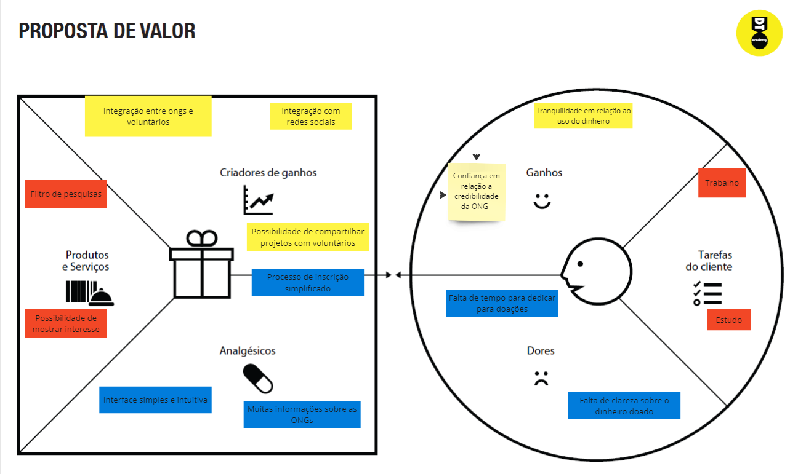
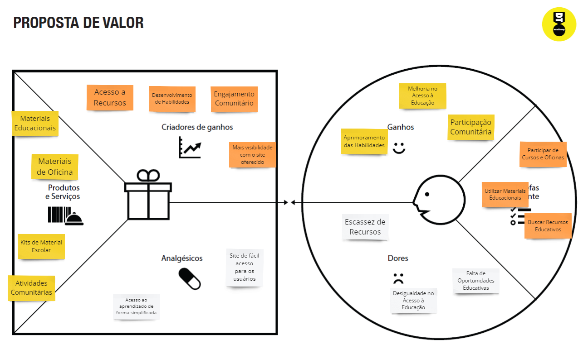
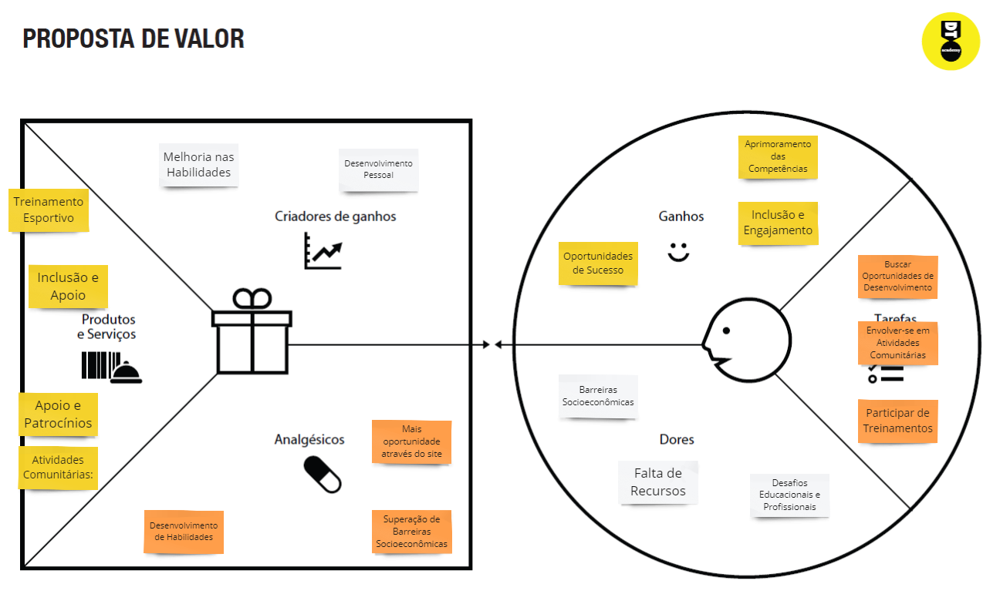
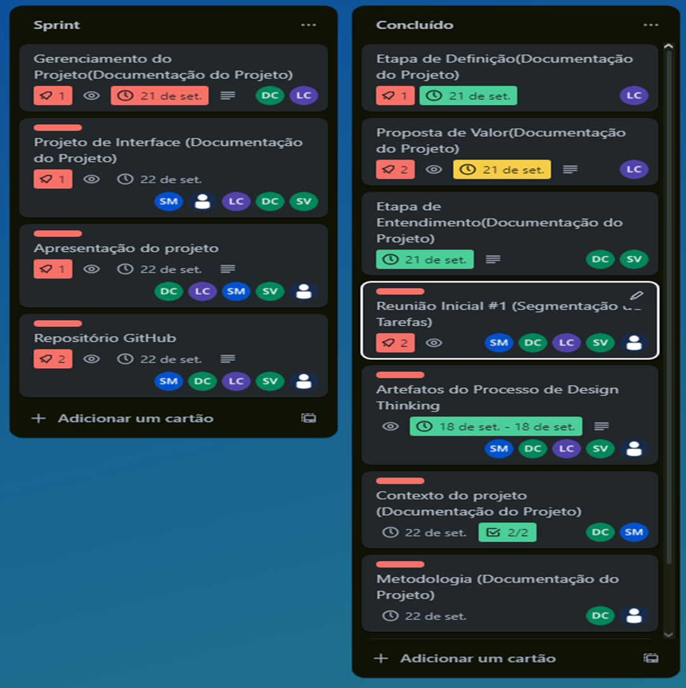

# Introdução

Informações básicas do projeto.

* **Projeto:** Solidarize.com
* **Repositório GitHub:** [LINK PARA O REPOSITÓRIO NO GITHUB](https://github.com/ICEI-PUC-Minas-PPLCC-TI/ti-1-ppl-cc-m-2024-2-g4-dificuldade-de-doacoes-para-ongs)
* **Membros da equipe:**

  * [David Cristhian Vieira Fonseca](https://github.com/DavidCristhian)
  * [Samuel de Jesus Fernandes Mascarenhas](https://github.com/SamuellMascarenhas)
  * [Lucas Cabral Bicalho](https://github.com/lucascabral1918)

A documentação do projeto é estruturada da seguinte forma:

1. Introdução
2. Contexto
3. Product Discovery
4. Product Design
5. Metodologia
6. Solução
7. Referências Bibliográficas

✅ [Documentação de Design Thinking (MIRO)](https://miro.com/app/board/uXjVKn-RAgk=/)

# Contexto

Detalhes sobre o espaço de problema, os objetivos do projeto, sua justificativa e público-alvo.

# Problema

ONGs enfrentam desafios significativos na arrecadação de fundos, resultando em dificuldades para manter o crescimento sustentável e construir a confiança dos doadores. Entre os principais obstáculos estão o acesso limitado a informações sobre as doações, a falta de transparência na gestão dos recursos arrecadados e experiências de usuário insatisfatórias em plataformas de doação, além de opções restritas para contribuir. Esses fatores fragilizam a relação entre doadores e ONGs, levando a uma baixa confiança na gestão dos recursos e dificultando o engajamento contínuo dos contribuintes.

A aplicação proposta visa resolver o problema da dificuldade de doação para ONGs, facilitando a conexão entre doadores e organizações. Ao atuar como uma “ponte” entre esses grupos, a plataforma promoverá a transparência e aumentará a confiança de todos os envolvidos, tornando o processo de doação mais acessível e eficaz.


## Objetivos


> O objetivo principal do projeto é criar uma solução para que as pessoas se sintam seguras ao realizarem doações a ONGs, aumentando, assim, a possibilidade de as ONGs receberem ajuda. Ademais, temos como objetivo claro ajudar as ONGs a disseminarem melhor sua imagem. Pretendemos fornecer uma aplicação com interface intuitiva, a fim de simplificar o processo de doação e alcançar um número maior de público-alvo, além de permitir que o usuário encontre as ONGs mais próximas.
>

## Justificativa


> A criação deste projeto se justifica pela necessidade de ajudar ONGs e projetos sociais por meio da colaboração entre ONGs e doadores. Buscamos alcançar o maior número possível de pessoas dispostas a apoiar causas importantes na sociedade, além de gerar a oportunidade de conectar de maneira eficaz ONGs e potenciais doadores, aumentando, assim, a visibilidade da necessidade e importância das doações. Sabemos que o número de doações tem diminuído ao longo do tempo. O relatório "Giving USA" de 2023 revelou que, nos Estados Unidos, as doações de caridade caíram para cerca de 499,33 bilhões de dólares em 2022. Com base nisso, vemos dados alarmantes sobre o problema. Além disso, por meio de entrevistas realizadas, percebemos que ONGs, em geral, possuem dificuldade em sensibilizar as pessoas sobre a importância do coletivo. A principal barreira é a desconfiança dos potenciais doadores quanto ao uso dos recursos, mesmo que haja um histórico sólido de transparência.


## Público-Alvo


>O público-alvo deste trabalho engloba tanto doadores potenciais quanto ONGs. Doadores potenciais incluem indivíduos de diferentes faixas etárias e perfis socioeconômicos, que têm interesse em apoiar causas sociais, ambientais, culturais ou educacionais, mas que podem sentir insegurança em relação ao processo de doação, seja por falta de transparência ou confiança. As ONGs, por outro lado, incluem organizações sem fins lucrativos que dependem de doações para manter suas atividades e que enfrentam desafios para alcançar e sensibilizar doadores. Além disso, o trabalho pode ser de interesse para profissionais do terceiro setor, captadores de recursos, voluntários e acadêmicos que estudam o comportamento filantrópico e a sustentabilidade de ONGs.


# Product Discovery

## Etapa de Entendimento

> * **Matriz CSD**: também conhecida por Matriz de Alinhamento, é uma ferramenta utilizada no Design Thinking para organizar informações e facilitar o processo de tomada de decisão e solução de problemas;

### **Dúvidas (O que ainda não sabemos sobre o problema)**

> 1. Quais instituições estariam participando do projeto?
> 2. Como se conectar com os projetos socias?
> 3. Como efetuar doações?
> 4. Como aumentar o alcance da plataforma para divulgar as ONGS?
> 5. O que deve ser feito para construir e manter a confiança dos doadores na plataforma?
> 6. Quais funcionalidades específicas os doadores mais valorizam em uma plataforma de doações?
> 7. Como garantir que as ONGs adotem a plataforma?
> 8. Como podemos solucionar as dificuldades que as pessoas tem quanto a acessibilidade para doar?
> 9. Como essa plataforma pode se diferenciar de outras já existentes?
> 10. Como fazer com que os doadores façam doações recorrentes em vez de doações únicas?
> 11. Quais desafios podem surgir ao tentar integrar uma nova plataforma?
> 12. Como garantir que a plataforma seja acessível para pessoas com deficiência ou com limitações tecnológicas ?
> 13. Qual é a melhor maneira de verificar a autenticidade e a legalidade das ONGs registradas na plataforma?

### **Certezas (O que já sabemos)**

> 1. Redes sociais estimulam doações.
> 2. Dificuldade em relação ao tempo
> 3. Pessoas mais tocadas pelo assunto já viram alguém próximo passando por dificuldades.
> 4. As pessoas se sentem mais motivadas para doar quando assistem algum vídeo/documentário sobre o assunto.
> 5. As pessoas buscam cada vez mais todo o tipo de informações sobre quem estão doando, para ter certeza de confiança.
> 6. Doadores estão cada vez mais preocupados com a transparência e querem saber exatamente como sua doação será utilizada.
> 7. Uma boa experiência de usuário ajuda a reter doadores.
> 8. As ONGS dependem fortemente de doações para continuar operando.
> 9. A cada ano a porcentagem das doações vem diminuindo gradativamente.
> 10. As ONGs enfrentam problemas para sustentar sua causa diariamente.

### **Suposições (O que achamos, mas não temos certeza)**

> 1. Doadores preferem direcionar suas doações para causas específicas (por exemplo, doações para projeto de educação ou saúde).
> 2. Baixa taxa de doações por desconfiança dos doadores sobre como a doação será utilizada.
> 3. Doadores são mais propensos a doar se a plataforma oferecer informações claras.
> 4. Pessoas não doam por falta de confiança em ongs não conhecidas.
> 5. Falta de meios confiáveis para doações online.
> 6. Falta de verba das ONGS para divulgarem e propagarem os meios de doação e o trabalho que fazem.
> 7. Pessoas que não doam por falta de dinheiro podem não saber que podem ajudar de outras formas, como trabalho voluntario, etc...
> 8. Se o doador fizer uma doação mensal recorrente (com cartão de credito por exemplo) ele acaba doando mais.
> 9. As pessoas são mais propensas a doar para ONGS próximas que resolvem problemas que elas conhecem do que distantes.
> 10. Muitas vezes pessoas deixam de doar pela falta de acessibilidade e divulgação, não sabem como e o processo.

> * **Mapa de stakeholders**: ferramenta que nos permite compreender o grupo de pessoas e entidades que devemos estudar e conversar para entender mais sobre o problema

### **Fundamentais**
> 1. ONGs.
> 2. Pessoas ajudadas pelas ONGS.
> 3. Doadores.

### **Importantes**

> 1. Governo local.
> 2. Redes sociais.
> 3. Consultorias que ajuda a medir e comunicar o impacto social das doações realizadas.
> 4. Parceiros financeiros.
> 5. Instituições que podem certificar a plataforma como segura e confiável.
> 6. Grupos e associações de ONGS que podem ajudar a divulgar a plataforma entre suas afiliadas.
> 7. Familiares.

### **Influenciadoras**

> 1. Influenciadores digitais, televisão, propaganda.
> 2. Mídia especializada em Filantropia.
> 3. Organizações de pesquisa e avaliações de impactos.
> 4. Organizações de certificações de Boas Práticas (exemplo: Charity Navigator, GuideStar etc).
> 5. Agências de desenvolvimento econômico e social.
> 6. Igrejas e cultos religiosos.

> * **Entrevistas qualitativas**: série de entrevistas qualitativas para validar suposições e solucionar as dúvidas com as principais pessoas envolvidas;

> Pergunta 1º: Quais são os maiores desafios que a ONG enfrenta para conseguir doações?

> Resposta: "Nosso maior desafio é sensibilizar as pessoas sobre a importância do nosso coletivo e como isso pode transformar vidas. Muitos não veem a urgência de doar para algo que consideram secundário. A principal barreira é a desconfiança dos potenciais doadores sobre como o dinheiro será usado, mesmo que tenhamos um histórico sólido."

> Pergunta 2º: Quais práticas ou estratégias você acredita serem mais eficazes para incentivar doadores a arrecadar fundos?

> Resposta: "Campanhas onde mostramos histórias reais de transformação através dos nossos projetos, têm sido muito eficazes para sensibilizar os doadores. Eventos presenciais, onde os doadores podem ver de perto o trabalho da ONG, sempre resultam em um aumento significativo nas doações."

> Pergunta 3º: Quais ferramentas você gostaria de implementar para melhorar a transparência e a confiança dos doadores?

> Resposta: "Gostaríamos de implementar um sistema onde o doador possa conhecer mais sobre o projeto específico que deseja apoiar e acompanhar o progresso em tempo real. Nós mesmo buscamos uma espécie de aplicativo, site, algo moderno e digital que permita aos doadores fazerem perguntas para nós e receberem respostas rápidas sobre como as doações estão sendo usadas, projetos ativos etc."

> Pergunta 4º: Quais informações foram cruciais para a sua decisão de doar para uma ONG?

> Resposta: "As principais informações necessárias foram saber para onde o dinheiro estava indo, para onde os produtos iam, se a ONG era confiável e quais eram as necessidades das pessoas relacionadas a ONG"

> Pergunta 5º: Como você gostaria de ser informado sobre o impacto de sua contribuição?

> Resposta: "Gostaria de receber atualizações sobre as pessoas e causas que ajudo. Como vídeos, fotos e textos, para mostrar como a ajuda faz a diferença para a causa. Também de gostaria de receber um feedback relacionado às pessoas afetadas pela causa, quem recebe as doações."

> Pergunta 5º: Se você fosse criar um aplicativo para realizar doações para ONGs, quais funcionalidades não poderiam faltar?

> Resposta: "Uma funcionalidade que permita você conhecer as pessoas para quem a doação é destinada, uma que permita que você identifique oque é preciso ser doado e uma que te mostre os impactos da sua doação."2º: "A possibilidade de o doador escolher para qual projeto específico deseja contribuir e receber atualizações automáticas sobre os resultados."

> * **Highlights de pesquisa**: um compilado do levantamento realizado por meio das entrevistas.

> Nome: Helena Muniz
> Data: 31 de agosto de 2024
> Local: Sion

> 1. O que os participantes falaram ou fizeram que surpreendeu, ou falas mais significativas: O que nos surpreendeu foi o fato da Helena não doar para alguma causa específica, já que imaginávamos que as pessoas teriam em mente exatamente a causa que mais as comovem.

> 2. Aspectos que importaram mais para os participantes: Em saber como o dinheiro seria utilizado e como ela iria receber atualizações sobre a causa no futuro.


> 3. Principais temas ou aprendizados que surgiram desta entrevista: Os principais temas  que surgiram foram: "Sensibilizar", "Feedback", "Transparência" e "Desconfiança".

> 4. Novos tópicos ou questões para explorar no futuro: Um modo para fazemos exatamente esta triagem de transparência das ONGs e dar o feedback aos doadores para que não fiquem passíveis de desconfiança no aplicativo ou site.

> Nome: Casa dos Livros
> Data: 28 de agosto de 2024
> Local: Ribeirão das Neves

> 1. O que os participantes falaram ou fizeram que surpreendeu, ou falas mais significativas: Os participantes ressaltaram o impacto significativo que a Casa dos Livros tem na promoção da leitura entre jovens de comunidades carentes. Uma fala marcante foi: "É inspirador ver como gestos de afeto e atenção podem mudar a vida de uma criança. As doações aqui realmente fazem a diferença."

> 2. Aspectos que importaram mais para os participantes: Transparência na utilização dos recursos, e a importância de manter os doadores informados sobre o impacto das doações. Também foi destacado o desejo de ver os resultados concretos, como a melhoria na educação das crianças.

> 3. Principais temas ou aprendizados que surgiram desta entrevista: A necessidade de fortalecer a comunicação e a transparência para garantir a confiança dos doadores. Além disso, foi identificado que a educação é um grande motivador para quem deseja contribuir.

> 4. Novos tópicos ou questões para explorar no futuro: Explorar como envolver mais os doadores no processo educativo, talvez através de programas de leitura conjunta ou eventos comunitários. Também, considerar a introdução de tecnologias que facilitem a doação e o acompanhamento do impacto.

> Nome: ONG Oportunidade
> Data: 29 de agosto de 2024
> Local: Santa Mônica

> 1. O que os participantes falaram ou fizeram que surpreendeu, ou falas mais significativas: Um destaque foi como a ONG Oportunidade consegue não só oferecer apoio financeiro, mas também abrir portas para novas oportunidades de educação e emprego. "Aqui, não se trata apenas de dinheiro, mas de construir um futuro melhor," disse um participante.

> 2. Aspectos que importaram mais para os participantes: Ver o impacto direto das doações na vida dos beneficiados, especialmente em termos de empregabilidade e acesso à educação. A continuidade do apoio e as histórias de sucesso foram aspectos altamente valorizados.

> 3. Principais temas ou aprendizados que surgiram desta entrevista: Os doadores valorizam o impacto concreto e as histórias de transformação. Ver os beneficiados alcançando empregos e melhorando suas vidas reforça a importância das doações.

> 4. Novos tópicos ou questões para explorar no futuro: Investir em parcerias com empresas para aumentar as oportunidades de emprego. Considerar a criação de uma plataforma onde os doadores possam acompanhar o progresso dos beneficiados ao longo do tempo.

## Etapa de Definição

### Personas
Persona 1:


Persona 2:



Persona 3:



Persona 4:



# Product Design

Nesse momento, vamos transformar os insights e validações obtidos em soluções tangíveis e utilizáveis. Essa fase envolve a definição de uma proposta de valor, detalhando a prioridade de cada ideia e a consequente criação de wireframes, mockups e protótipos de alta fidelidade, que detalham a interface e a experiência do usuário.

## Histórias de Usuários

Com base na análise das personas foram identificadas as seguintes histórias de usuários:

| EU COMO... | QUERO/PRECISO ...        | PARA ...              |
| --------------------- | ------------------------------------------ | -------------------------------------- |
| Eu como ONG |Preciso de um painel  que me mostre  doações em tempo  real | Para ter controle imediato sobre os  recursos disponíveis. |
| Eu como ONG |Preciso de um sistema  para categorizar os tipos  de doadores (frequentes,  ocasionais, etc.) | Para criar campanhas específicas para cada  perfil. |
| Eu como  doador | Preciso  de informações facilitadas sobre as ONGs | Para ter noção para  quem estou doando e  sobre a confiabilidade  dela. |
| Eu como  doador | Compartilhar os  perfis das minhas ONGs preferidas  | Para divulgar as ONGs e incentivar as  pessoas a doarem.|
| Eu como  ONG | Preciso de uma forma  de compartilhar  histórias de sucesso de nossos beneficiários   |Para aumentar a  credibilidade e inspirar  mais doadores a contribuir.|
| Eu como  doador | Preciso de incentivos,  como relatórios de impacto ou  certificações de doação      | Para me sentir  recompensado e  motivado a continuar  doando. |
| Eu como  doador | Preciso de a  possibilidade de doar anonimamente   |Para preservar  minha privacidade  ao contribuir.|
| Eu como  doador | Preciso de conhecer os projetos ou causas  disponíveis para  doação    | Para escolher onde  minha contribuição  será mais significativa. |
| Eu como  doador  | Preciso de uma  confirmação imediata e  detalhada após realizar  uma doação | Para ter certeza de que minha contribuição foi  recebida e está sendo  processada. |
| Eu como  doador | Preciso de uma  plataforma segura,  e transparente. | Para permitir que possam administrar contas. |
| Eu como  ONG | Preciso de uma  solução para que  pessoas, conheçam o  nosso trabalho.| Para viabilizar os  projetos da ONG. |
| Eu como  doador | Preciso de receber  atualizações sobre  como minha doação  está sendo usada |Para saber o impacto que  estou gerando. |
| Eu como  ONG |Preciso de uma  ferramenta que me  ajude a gerenciar os  doadores | Para manter um  relacionamento  contínuo e  transparente com eles. |
| Eu como  doador| Preciso conhecer novas ONGS e  projetos | Para conseguir ajudar mais  ONGs, gerar mais impacto e diversificar minhas doações. |
| Eu como   ONG  | Preciso de uma forma  facilitada para  comunicação com o  doador |Para manter a  transparência com os  doadores e dar  atualizações sobre a causa.|
| Eu como Doador | Preciso acompanhar  os resultados das  doações |Para saber e acompanhar  os impactos sociais  que provém das  minhas doações.|
| Eu como ONG  | Preciso de uma plataforma que ofereça diferentes  métodos de pagamento  para doações| Para facilitar a  captação de recursos  de diversos perfis de  doadores.|
| Eu como  doador | Preciso de uma  forma fácil de doar,  com poucos cliques|Para poder contribuir  rapidamente em  campanhas que me interessam.|

## Proposta de Valor

Diagramas de Proposta de Valor

> O mapa da proposta de valor é uma ferramenta que nos ajuda a definir qual tipo de produto ou serviço melhor atende às personas definidas anteriormente.

Persona 1:



Persona 2:


Persona 3:



Persona 4:




## Requisitos

As tabelas que se seguem apresentam os requisitos funcionais e não funcionais que detalham o escopo do projeto.

### Requisitos Funcionais

| ID     | Descrição do Requisito                                                                                                                   | Prioridade ⚠️ |
| ------ | -----------------------------------------------------------------------------------------------------------------------------------------| -------------- |
| RF-001 | ONGs devem ser capazes de se cadastrar na plataforma, fornecendo informações como nome, descrição, categoria, e dados de contato.        | ALTA          |      
| RF-002 | Doadores devem se cadastrar fornecendo informações pessoais e preferências de doação.                                                    | MÉDIA         |
| RF-003 | ONGs devem poder criar e editar projetos, incluindo descrição, metas e prazo.                                                            | BAIXA         |
| RF-004 | ONGs devem ter acesso a um painel de controle que exiba doações em tempo real e histórico de transações                                  | BAIXA         |
| RF-005 | Doadores devem poder pesquisar e filtrar ONGs e projetos por categoria, localização e impacto.                                           | ALTA          |
| RF-006 | Doadores devem realizar doações de forma simples e receber confirmação imediata.                                                         | ALTA          |
| RF-007 | ONGs devem poder compartilhar histórias de sucesso de beneficiários para aumentar a credibilidade.                                       | ALTA          |
| RF-008 | Doadores devem poder compartilhar perfis de ONGs em redes sociais para incentivar outras pessoas a doarem                                | ALTA          |
| RF-009 | O sistema deve fornecer incentivos, como relatórios de impacto e certificados, para motivar os doadores.                                 | MÉDIA         |
| RF-010 | Doadores devem poder avaliar ONGs e deixar feedback sobre suas experiências.                                                             | MÉDIA         |
| RF-011 | Os usuários poderão encontrar as respostas às dúvidas mais comuns.                                                                       | ALTA          |
| RF-012 | Possibilidade do usuário entrar em contato diretamente com o suporte por meio do e-mail e/ou Whatsapp.                                   | ALTA          |

### Requisitos não Funcionais

| ID      | Descrição do Requisito                                                                                                                   | Prioridade ⚠️ |
| ------- | -------------------------------------------------------------------------------------                                                    | --------------|
| RNF-001 | A plataforma deve ter uma interface intuitiva e de fácil navegação, adequada para todos os perfis de usuários                            | ALTA          |      
| RNF-002 | A plataforma deve garantir a proteção de dados pessoais e financeiros dos usuários, conforme as regulamentações de privacidade.          | ALTA          |


## Projeto de Interface

Artefatos relacionados com a interface e a interacão do usuário na proposta de solução.

### Wireframes

Estes são os protótipos de telas do sistema.

##### Wireframs Landing Page


### User Flow


### Protótipo Interativo

✅ [Protótipo Interativo (FIGMA)](https://www.figma.com/proto/wY9F7p34OYJgGed354RgQz/LP_ONGS-(Prot%C3%B3tipo-Est%C3%A1tico)?page-id=0%3A1&node-id=2-3&node-type=canvas&viewport=309%2C-1783%2C0.5&t=6Wa0C76NLTTjsvEl-1&scaling=scale-down&content-scaling=fixed) 

# Metodologia

Detalhes sobre a organização do grupo e o ferramental empregado.

## Ferramentas

Relação de ferramentas empregadas pelo grupo durante o projeto.

| Ambiente                    | Plataforma | Link de acesso                                     |
| --------------------------- | ---------- | -------------------------------------------------- |
| Processo de Design Thinking | Miro       | [trello](https://miro.com/app/board/uXjVKn-RAgk=/) |
| Repositório de código       | GitHub     | [github](https://github.com/ICEI-PUC-Minas-PPLCC-TI/ti-1-ppl-cc-m-2024-2-g4-dificuldade-de-doacoes-para-ongs )|
| Hospedagem do site          | Figma      | [figma](https://www.figma.com/proto/wY9F7p34OYJgGed354RgQz/LP_ONGS-(Prot%C3%B3tipo-Est%C3%A1tico)?page-id=0%3A1&node-id=2-3&node-type=canvas&viewport=309%2C-1783%2C0.5&t=6Wa0C76NLTTjsvEl-1&scaling=scale-down&content-scaling=fixed)|
| Protótipo Interativo        | Trello     | [trello](https://trello.com/b/3KU3k8bd/trabalho-interdisciplinar-g4)   |
|                             |            |                                                    |

> ⚠️ **APAGUE ESSA PARTE ANTES DE ENTREGAR SEU TRABALHO**
>
> Liste as ferramentas empregadas no desenvolvimento do projeto, justificando a escolha delas, sempre que possível. Inclua itens como: (1) Editor de código, (2) )ferramentas de comunicação, (3) )ferramentas de diagramação, (4) )plataformas de hospedagem, entre outras.

## Gerenciamento do Projeto

Divisão de papéis no grupo e apresentação da estrutura da ferramenta de controle de tarefas (Kanban).



> ⚠️ **APAGUE ESSA PARTE ANTES DE ENTREGAR SEU TRABALHO**
>
> Nesta parte do documento, você deve apresentar  o processo de trabalho baseado nas metodologias ágeis, a divisão de papéis e tarefas, as ferramentas empregadas e como foi realizada a gestão de configuração do projeto via GitHub.
>
> Coloque detalhes sobre o processo de Design Thinking e a implementação do Framework Scrum seguido pelo grupo. O grupo poderá fazer uso de ferramentas on-line para acompanhar o andamento do projeto, a execução das tarefas e o status de desenvolvimento da solução.
>
> **Orientações**:
>
> - [Sobre Projects - GitHub Docs](https://docs.github.com/pt/issues/planning-and-tracking-with-projects/learning-about-projects/about-projects)
> - [Gestão de projetos com GitHub | balta.io](https://balta.io/blog/gestao-de-projetos-com-github)
> - [(460) GitHub Projects - YouTube](https://www.youtube.com/playlist?list=PLiO7XHcmTsldZR93nkTFmmWbCEVF_8F5H)
> - [11 Passos Essenciais para Implantar Scrum no seu Projeto](https://mindmaster.com.br/scrum-11-passos/)
> - [Scrum em 9 minutos](https://www.youtube.com/watch?v=XfvQWnRgxG0)

# Solução Implementada

Esta seção apresenta todos os detalhes da solução criada no projeto.

## Vídeo do Projeto

O vídeo a seguir traz uma apresentação do problema que a equipe está tratando e a proposta de solução. ⚠️ EXEMPLO ⚠️

[](https://www.youtube.com/embed/70gGoFyGeqQ)

> ⚠️ **APAGUE ESSA PARTE ANTES DE ENTREGAR SEU TRABALHO**
>
> O video de apresentação é voltado para que o público externo possa conhecer a solução. O formato é livre, sendo importante que seja apresentado o problema e a solução numa linguagem descomplicada e direta.
>
> Inclua um link para o vídeo do projeto.

## Funcionalidades

Esta seção apresenta as funcionalidades da solução.Info

##### Funcionalidade 1 - Cadastro de Contatos ⚠️ EXEMPLO ⚠️

Permite a inclusão, leitura, alteração e exclusão de contatos para o sistema

* **Estrutura de dados:** [Contatos](#ti_ed_contatos)
* **Instruções de acesso:**
  * Abra o site e efetue o login
  * Acesse o menu principal e escolha a opção Cadastros
  * Em seguida, escolha a opção Contatos
* **Tela da funcionalidade**:


> ⚠️ **APAGUE ESSA PARTE ANTES DE ENTREGAR SEU TRABALHO**
>
> Apresente cada uma das funcionalidades que a aplicação fornece tanto para os usuários quanto aos administradores da solução.
>
> Inclua, para cada funcionalidade, itens como: (1) titulos e descrição da funcionalidade; (2) Estrutura de dados associada; (3) o detalhe sobre as instruções de acesso e uso.

## Estruturas de Dados

Descrição das estruturas de dados utilizadas na solução com exemplos no formato JSON.Info

##### Estrutura de Dados - Contatos   ⚠️ EXEMPLO ⚠️

Contatos da aplicação

```json
  {
    "id": 1,
    "nome": "Leanne Graham",
    "cidade": "Belo Horizonte",
    "categoria": "amigos",
    "email": "Sincere@april.biz",
    "telefone": "1-770-736-8031",
    "website": "hildegard.org"
  }
  
```

##### Estrutura de Dados - Usuários  ⚠️ EXEMPLO ⚠️

Registro dos usuários do sistema utilizados para login e para o perfil do sistema

```json
  {
    id: "eed55b91-45be-4f2c-81bc-7686135503f9",
    email: "admin@abc.com",
    id: "eed55b91-45be-4f2c-81bc-7686135503f9",
    login: "admin",
    nome: "Administrador do Sistema",
    senha: "123"
  }
```

> ⚠️ **APAGUE ESSA PARTE ANTES DE ENTREGAR SEU TRABALHO**
>
> Apresente as estruturas de dados utilizadas na solução tanto para dados utilizados na essência da aplicação quanto outras estruturas que foram criadas para algum tipo de configuração
>
> Nomeie a estrutura, coloque uma descrição sucinta e apresente um exemplo em formato JSON.
>
> **Orientações:**
>
> * [JSON Introduction](https://www.w3schools.com/js/js_json_intro.asp)
> * [Trabalhando com JSON - Aprendendo desenvolvimento web | MDN](https://developer.mozilla.org/pt-BR/docs/Learn/JavaScript/Objects/JSON)

## Módulos e APIs

Esta seção apresenta os módulos e APIs utilizados na solução

**Images**:

* Unsplash - [https://unsplash.com/](https://unsplash.com/) ⚠️ EXEMPLO ⚠️

**Fonts:**

* Icons Font Face - [https://fontawesome.com/](https://fontawesome.com/) ⚠️ EXEMPLO ⚠️

**Scripts:**

* jQuery - [http://www.jquery.com/](http://www.jquery.com/) ⚠️ EXEMPLO ⚠️
* Bootstrap 4 - [http://getbootstrap.com/](http://getbootstrap.com/) ⚠️ EXEMPLO ⚠️

> ⚠️ **APAGUE ESSA PARTE ANTES DE ENTREGAR SEU TRABALHO**
>
> Apresente os módulos e APIs utilizados no desenvolvimento da solução. Inclua itens como: (1) Frameworks, bibliotecas, módulos, etc. utilizados no desenvolvimento da solução; (2) APIs utilizadas para acesso a dados, serviços, etc.

# Referências

As referências utilizadas no trabalho foram:

* SOBRENOME, Nome do autor. Título da obra. 8. ed. Cidade: Editora, 2000. 287 p ⚠️ EXEMPLO ⚠️

> ⚠️ **APAGUE ESSA PARTE ANTES DE ENTREGAR SEU TRABALHO**
>
> Inclua todas as referências (livros, artigos, sites, etc) utilizados no desenvolvimento do trabalho.
>
> **Orientações**:
>
> - [Formato ABNT](https://www.normastecnicas.com/abnt/trabalhos-academicos/referencias/)
> - [Referências Bibliográficas da ABNT](https://comunidade.rockcontent.com/referencia-bibliografica-abnt/)
